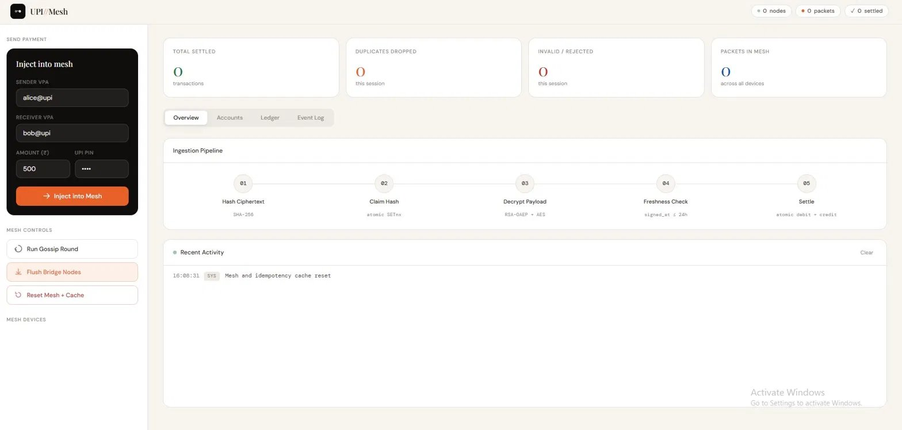
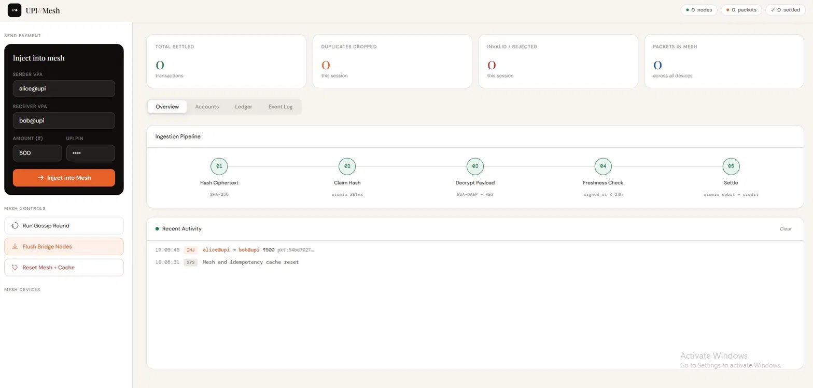
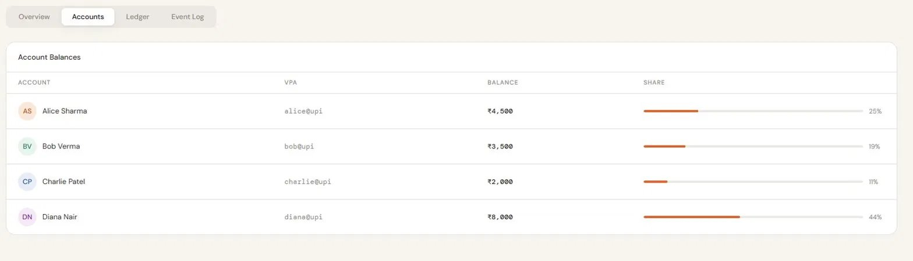
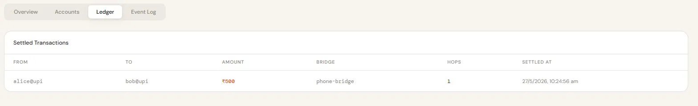

# UPI / Mesh

> Offline-first UPI payments over a Bluetooth mesh — demo backend & simulation

---

## The Problem

India processes over 13 billion UPI transactions a month — but a significant portion fail silently due to poor or no network connectivity in rural areas, crowded venues, and underground spaces. **UPI Mesh** explores what it would look like if payments could travel peer-to-peer across nearby devices and settle automatically when any device in the network regains connectivity.

---

## Screenshots

### Dashboard — Idle State

*Clean idle state showing the 5-step ingestion pipeline and real-time activity log.*

### Payment Injected into Mesh

*Alice injects a ₹500 packet to Bob. The packet enters the mesh with a unique hash and awaits settlement via bridge flush.*

### Account Balances

*Live account balances across all VPAs. Balance share bar shows proportional distribution.*

### Settlement Ledger

*Settled transactions with bridge node, hop count, and timestamp. Each row is immutable once written.*

---

## How It Works

Payments don't settle immediately — they travel through a 5-step ingestion pipeline:

```
[Sender Device]
      │
      ▼
01 — Hash Ciphertext     SHA-256 fingerprint of the encrypted payload
      │
      ▼
02 — Claim Hash          Atomic SETnx — prevents double-spend / replay attacks
      │
      ▼
03 — Decrypt Payload     RSA-OAEP + AES hybrid decryption
      │
      ▼
04 — Freshness Check     Rejects packets older than 24 hours
      │
      ▼
05 — Settle              Atomic debit + credit on sender and receiver accounts
```

**The two-step flow:**
- `Inject` → packet enters the mesh and propagates across nearby bridge nodes
- `Flush Bridge Nodes` → bridge node regains connectivity and submits pending packets for settlement

This accurately simulates how offline-to-online reconciliation would work in a real deployment.

---

## Security Model

| Mechanism | Purpose |
|---|---|
| RSA-OAEP + AES hybrid encryption | Payload is unreadable in transit |
| SHA-256 hash + atomic SETnx | Each packet can only settle once — prevents replay attacks |
| `signed_at` freshness check | Stale packets (> 24h) are rejected automatically |
| Server-side RSA keypair | Generated fresh on startup via `ServerKeyHolder` |

---

## Tech Stack

- **FastAPI** — async REST backend
- **SQLAlchemy** — ORM with atomic transaction support
- **cryptography** — RSA-OAEP + AES-GCM encryption
- **SQLite** — lightweight persistent store (swap for Postgres in production)
- **Uvicorn** — ASGI server with hot reload

---

## Getting Started

```bash
# 1. Clone the repo
git clone https://github.com/your-username/upi-offline-mesh.git
cd upi-offline-mesh

# 2. Install dependencies
pip install -r requirements.txt

# 3. Start the server
uvicorn main:app --reload

# 4. Open the dashboard
# http://localhost:8000
```

**Demo accounts seeded on startup:**

| Name | VPA | Balance |
|---|---|---|
| Alice Sharma | alice@upi | ₹4,500 |
| Bob Verma | bob@upi | ₹3,500 |
| Charlie Patel | charlie@upi | ₹2,000 |
| Diana Nair | diana@upi | ₹8,000 |

---

## API Reference

| Method | Endpoint | Description |
|---|---|---|
| `POST` | `/api/demo/send` | Inject a payment packet into the mesh |
| `POST` | `/api/mesh/flush` | Flush bridge nodes — settle pending packets |
| `POST` | `/api/mesh/gossip` | Run a gossip round across known peers |
| `POST` | `/api/mesh/reset` | Reset mesh state and idempotency cache |
| `GET` | `/api/mesh/state` | Current mesh stats (packets, nodes, settled) |
| `GET` | `/api/accounts` | All account balances |
| `GET` | `/api/transactions` | Settled transaction ledger |

---

## Project Structure

```
upi-offline-mesh/
├── main.py                  # FastAPI app + lifespan
├── models/
│   └── db.py                # SQLAlchemy models (accounts, transactions)
├── services/
│   └── demo_service.py      # Account seeding
├── crypto/
│   └── key_holder.py        # RSA keypair generation + storage
├── routers/
│   └── api.py               # All route handlers
├── static/
│   └── index.html           # Frontend dashboard
└── requirements.txt
```

---

## Limitations & Roadmap

This is a **simulation** — the mesh runs over HTTP on localhost, not actual radio. To make it truly offline:

- [ ] Android app using `BluetoothLeAdvertiser` / `WifiP2pManager` for real peer discovery
- [ ] Port settlement logic to on-device SQLite (Room or similar)
- [ ] NPCI-compatible settlement API integration for production flush
- [ ] Multi-hop packet routing with TTL and loop detection
- [ ] PIN verification via NPCI-issued key rather than demo passthrough

---

## License

MIT
